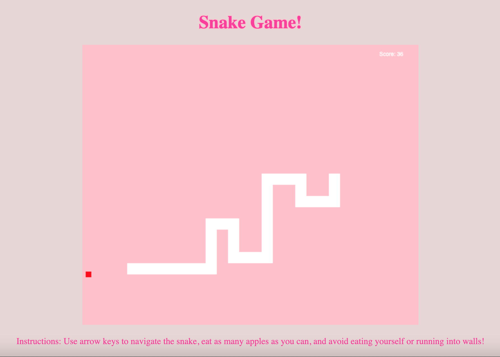

# Snake Game!

 
Can you reach 50?
Instructions: Use arrow keys to navigate the snake, eat as many apples as you can, and avoid eating yourself or running into walls!
 

Click [here to play!](https://natsal33.github.io/snakeGame/)

 

## Summary

Snake Game! Is a virtual game where the goal is to eat as many apples and grow your snake as long as possible. Using the direction arrow keys, direct the snake up, down, left, and right across the gameboard (but not backwards!) to hunt for delicious apples to eat. Every time the snake eats an apple, its body grows by one link! The game ends when you collide with a wall or the snake accidentally "eats" itself. Score resets after each round, what will your high score be?

 

##Author

- **Natalie Salazar** - Software Developer
